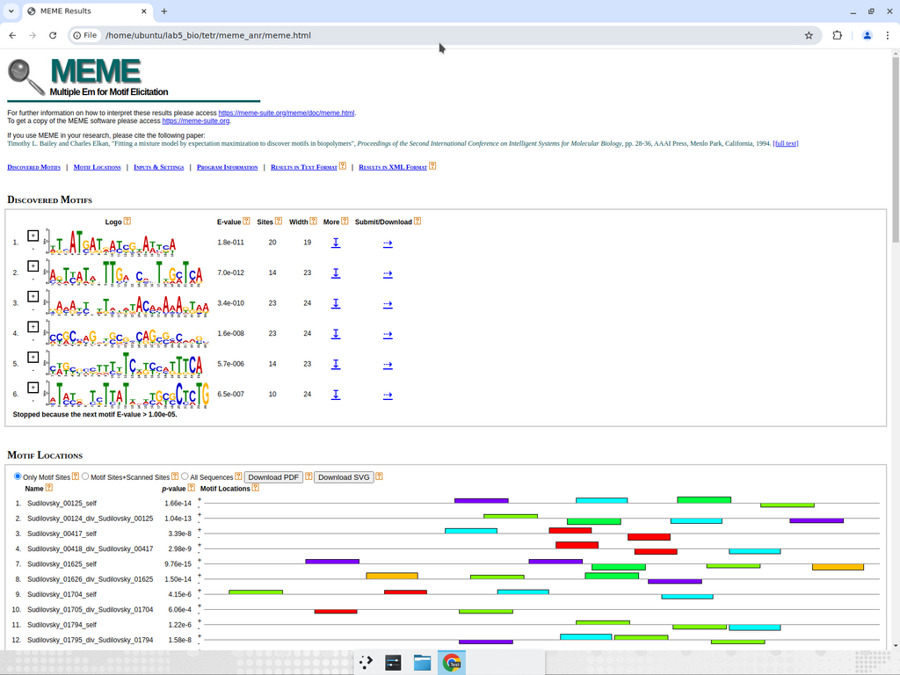
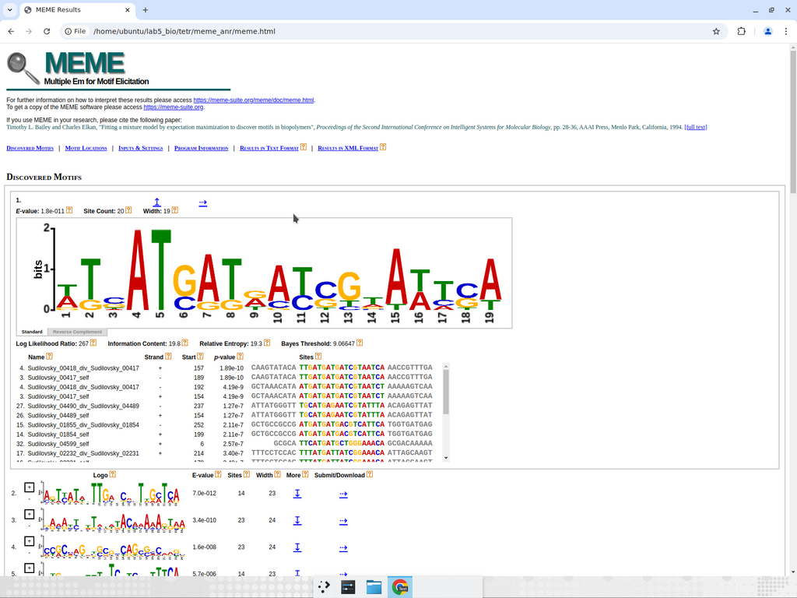
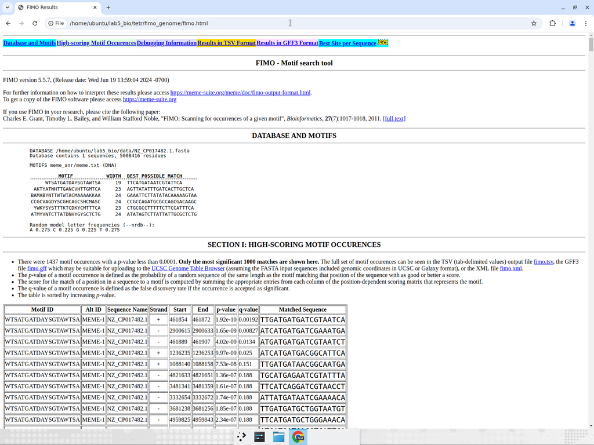

\thispagestyle{empty}

\begin{center}
\large
МИНИСТЕРСТВО ОБРАЗОВАНИЯ РЕСПУБЛИКИ БЕЛАРУСЬ \\[2pt]
БЕЛОРУССКИЙ ГОСУДАРСТВЕННЫЙ УНИВЕРСИТЕТ \\[2pt]
БИОЛОГИЧЕСКИЙ ФАКУЛЬТЕТ \\[2pt]
Кафедра молекулярной биологии
\end{center}

\vspace{60pt}

\begin{center}
\large\bfseries
ОТЧЁТ \\[6pt]
по лабораторной работе №5 \\[6pt]
«Аннотация бактериального генома и поиск сайтов связывания
транскрипционных факторов семейства TetR
в геноме \emph{Pectobacterium polaris} NIBIO1392»
\end{center}

\vspace{80pt}

\begin{flushright}
\begin{tabular}{ll}
Выполнили студенты: & Судиловский Л. \\
                    & Колешко В.\\[12pt]
Вариант:            & 8 \\[12pt]
Преподаватель:      & \rule{6cm}{0.4pt} \\
\end{tabular}
\end{flushright}

\vfill

\begin{center}
Минск 2026
\end{center}

\newpage

# Реферат

Отчёт содержит описание выполнения лабораторной работы №5 — аннотации
полностью секвенированного хромосомного контига бактерии
*Pectobacterium polaris* штамм NIBIO1392 (NCBI accession **NZ_CP017482.1**)
при помощи программного пакета **Prokka 1.14.6** и последующего поиска
участков ДНК, потенциально связывающих транскрипционные факторы
семейства **TetR** (Pfam **PF00440**), при помощи пакета **MEME Suite 5.5.7**
(программы MEME и FIMO).

Объём работы: \pageref{LastPage}~с., 9 таблиц, 1 рисунок, 12 источников,
3 приложения.

**Ключевые слова:** биоинформатика, аннотация генома, Prokka,
*Pectobacterium polaris*, транскрипционные факторы, семейство TetR,
сайты связывания, MEME, FIMO, Pfam.

**Объект исследования:** хромосома штамма *Pectobacterium polaris* NIBIO1392
длиной 5 008 416 п.н.

**Цель работы:** провести самостоятельную аннотацию указанного генома
с префиксом локус-тегов `Sudilovsky`, сравнить полученную аннотацию
с существующей в NCBI RefSeq, найти и охарактеризовать сайты связывания
транскрипционных факторов семейства TetR.

**Полученные результаты.** Аннотация Prokka выявила 4 390 кодирующих
последовательностей (CDS), 77 тРНК, 15 рРНК, 1 тмРНК и 163 некодирующих
РНК; различия с эталонной аннотацией NCBI объяснены методически.
В геноме найдено 19 белков семейства TetR. На основании 32 апстрим-областей
этих белков и их дивергентных соседей с помощью MEME *de novo* построен
профиль сайта связывания (консенсус `WTSATGATDAYSGTAWTSA`,
E-value $1{,}8 \cdot 10^{-11}$). Сканирование генома программой FIMO
выявило 32 высокозначимых сайта связывания
($p < 10^{-6}$); 7 из них располагаются непосредственно перед
TetR-генами, что соответствует типичной авторегуляторной архитектуре
TetR-репрессоров и подтверждает биологическую релевантность найденного
мотива.

\newpage

# Перечень условных обозначений и сокращений

| Сокращение | Расшифровка |
|---|---|
| BGU / БГУ | Белорусский государственный университет |
| CDS | coding DNA sequence — кодирующая последовательность |
| CM | covariance model — ковариационная модель Infernal/Rfam |
| GC | gene cluster — содержание гуанин-цитозин в ДНК |
| GO | Gene Ontology |
| HMM | hidden Markov model — скрытая марковская модель |
| HTH | helix-turn-helix — мотив «спираль-поворот-спираль» |
| ncRNA | non-coding RNA — некодирующая РНК |
| NCBI | National Center for Biotechnology Information |
| ORF | open reading frame — открытая рамка считывания |
| PWM | position weight matrix — позиционно-весовая матрица |
| RefSeq | Reference Sequence Database (NCBI) |
| TF / ТФ | transcription factor — транскрипционный фактор |
| TFBS | transcription factor binding site — сайт связывания ТФ |
| тРНК / тмРНК | транспортная / транспортно-матричная РНК |
| п.н. | пар нуклеотидов |

\newpage

# Введение

Полное прочтение генома бактерии (whole-genome sequencing) на современных
платформах NGS даёт исходный материал — последовательность нуклеотидов,
которая сама по себе биологически малоинформативна. Чтобы превратить
сырую последовательность в инструмент исследования, её необходимо
**аннотировать**: разметить кодирующие гены, рРНК-гены, тРНК-гены, малые
некодирующие РНК, регуляторные элементы. Стандартом *de facto* для
бактериальных геномов является пакет *Prokka* T. Seemann [1], сочетающий
предсказание ORF (Prodigal), поиск рРНК (barrnap), тРНК (Aragorn),
малых РНК и риботсвичей (Infernal/Rfam) и присвоение функций по поиску
гомологий в SwissProt и HAMAP.

Помимо собственно генов, важными элементами генома являются *цис*-регуляторные
последовательности, в первую очередь сайты связывания транскрипционных
факторов (TFBS). Семейство **TetR** (Pfam PF00440) — одно из крупнейших
семейств бактериальных регуляторов, характеризующееся консервативным
N-концевым HTH-доменом и модульной C-концевой лиганд-связывающей
областью. В большинстве случаев TetR-белки выступают в роли репрессоров,
авторегулирующих собственный промотор и регулирующих гены оттока
антибиотиков, ферменты вторичного метаболизма и системы стрессового
ответа [2, 3]. Соответствующие операторные сайты, как правило,
квази-палиндромны и располагаются непосредственно перед TetR-геном
и/или перед дивергентно ориентированным геном-мишенью.

В рамках настоящей лабораторной работы требовалось:

а) скачать в формате FASTA геном бактерии, заданной вариантом
(вариант 8 — `NZ_CP017482.1`, *Pectobacterium polaris* NIBIO1392);

б) самостоятельно аннотировать его, обеспечив префикс локус-тегов
вида фамилии исполнителя латиницей (`Sudilovsky`);

в) сравнить полученные количества генов / CDS / некодирующих РНК
с существующей аннотацией в NCBI RefSeq и объяснить выявленные различия;

г) найти в проаннотированном геноме сайты связывания транскрипционного
фактора заданного семейства (вариант 8 — TetR);

д) описать ход работы, промежуточные и итоговые результаты в виде
формализованного отчёта.

Вся вычислительная часть работы воспроизводима: репозиторий
<https://github.com/SailorVAC/lab5_bio> содержит сценарий
`setup.sh` (установка всех программ) и `Makefile` (запуск всего пайплайна
одной командой `make all`).

\newpage

# Обзор использованных программных средств

## Prokka

Prokka [1] — конвейер аннотации бактериальных, архейных и вирусных
геномов. Внутри он последовательно вызывает:

* **Prodigal 2.6.3** [4] — предсказание открытых рамок считывания (CDS)
по марковским моделям 5-го порядка, обученным на самой
анализируемой последовательности (`single mode`);
* **Aragorn 1.2.41** [5] — поиск тРНК и тмРНК по комбинированному алгоритму
динамического программирования;
* **barrnap 0.9** — поиск рибосомных РНК (5S, 16S, 23S) на основе
HMM-профилей RFAM/Silva через HMMER;
* **Infernal 1.1.4** [6] совместно с базой Rfam 14.1 — поиск малых
некодирующих РНК (рибосвитчи, регуляторные РНК, тмРНК) по
ковариационным моделям;
* **BLAST+ 2.12** + **HMMER 3.3.2** [7] — присвоение функций по
гомологии: сначала к курируемой подмножественной базе SwissProt
(kingdom Bacteria), затем к семейству HMM-профилей HAMAP, и, при
необходимости, к расширенным базам.

Особенностью Prokka является «строгая» конвенция выходных файлов:
все элементы (CDS, tRNA, rRNA, и т. д.) получают единый
префикс `<--locustag>_NNNNN`, что и потребовалось в условии задачи.

## HMMER, Pfam и поиск белков семейства TetR

Пакет **HMMER 3.3.2** [7] реализует алгоритмы построения и поиска по
скрытым марковским моделям белковых доменов. База **Pfam** [8]
содержит ~20 000 курируемых HMM-профилей. Семейство TetR имеет
профиль `PF00440 TetR_N` длиной 47 а.к., описывающий N-концевой
HTH-домен. Поиск производится командой `hmmscan` с порогом
gathering threshold (`--cut_ga`), специфичным для данного семейства.

## MEME и FIMO

**MEME** (Multiple Em for Motif Elicitation) [9] — программа поиска
*de novo* мотивов в наборе последовательностей методом
Expectation-Maximization. Поддерживает три режима числа сайтов:
`oops` (один сайт на последовательность), `zoops` (нуль или один) и
`anr` (несколько сайтов, **anr** = "any number of repetitions"); последний
наиболее адекватен для регуляторных областей с несколькими операторными
полусайтами. Опция `-revcomp` указывает учитывать оба ДНК-стрэнда, что
обязательно для палиндромных мотивов TetR.

**FIMO** (Find Individual Motif Occurrences) [10] — компонент того же
пакета, осуществляющий поиск *уже найденного* мотива в произвольной
последовательности с расчётом p-value и q-value для каждого попадания.

## Используемые версии

\begin{table}[h]
\centering
\caption{Версии использованных программных средств}
\begin{tabular}{ll}
\hline
Программа & Версия \\
\hline
Prokka & 1.14.6 \\
Prodigal & 2.6.3 \\
Aragorn & 1.2.41 \\
barrnap & 0.9 \\
Infernal & 1.1.4 \\
HMMER & 3.3.2 \\
NCBI BLAST+ & 2.12.0 \\
MEME Suite (meme, fimo) & 5.5.7 \\
Biopython & 1.85 \\
Pfam & 37 (профиль PF00440) \\
Rfam & 14.1 \\
\hline
\end{tabular}
\end{table}

\newpage

# Материалы и методы

## Объект исследования

Работа выполнялась с полным геномом штамма *Pectobacterium polaris*
NIBIO1392, депонированным в базе NCBI Nuccore под номером
**NZ_CP017482.1**. Это циркулярная хромосома длиной 5 008 416 п.н.,
обеспечена эталонной аннотацией NCBI RefSeq (BioProject PRJNA224116,
BioSample SAMN05853907, Assembly GCF_002288545.1) и взята из публикации
M.W. Dees и соавт. [11].

Базовые статистические характеристики первичной последовательности
(посчитаны программно средствами Biopython, см. рис. 1):

* длина: 5 008 416 п.н.;
* GC-содержание: 51,99 %;
* A: 1 203 708 (24,03 %); T: 1 200 716 (23,97 %);
* G: 1 297 093 (25,90 %); C: 1 306 899 (26,10 %).

## Скачивание данных

Первичная последовательность и эталонная аннотация были получены
через E-utilities NCBI:

```bash
curl "https://eutils.ncbi.nlm.nih.gov/entrez/eutils/efetch.fcgi?\
db=nuccore&id=NZ_CP017482.1&rettype=fasta&retmode=text" \
   -o data/NZ_CP017482.1.fasta
curl "https://eutils.ncbi.nlm.nih.gov/entrez/eutils/efetch.fcgi?\
db=nuccore&id=NZ_CP017482.1&rettype=gbwithparts&retmode=text" \
   -o data/NZ_CP017482.1_NCBI.gbk
```

Размеры полученных файлов: FASTA — 4,9 МБ, GenBank — 12,5 МБ.

## Установка программного обеспечения

В операционной системе Ubuntu 22.04 LTS требуемые пакеты были
установлены автоматически сценарием `setup.sh`, выполняющим:

1. установку через apt пакетов
   `prokka barrnap hmmer infernal ncbi-blast+ aragorn prodigal
   bioperl libopenmpi-dev openmpi-bin`;
2. подкачку отсутствующей в Debian-пакете базы данных Prokka
   (UniProt SwissProt и HAMAP HMM) из upstream-репозитория
   `tseemann/prokka`;
3. сборку MEME Suite 5.5.7 из исходников
   (`./configure --prefix=$HOME/meme && make && make install`);
4. установку Python-зависимостей `biopython`, `openpyxl`,
   `pdfminer.six` через pip.

Полный текст сценария — см. файл `setup.sh` в репозитории.

## Запуск аннотации

Аннотация запускалась командой

```bash
prokka --outdir annotation --prefix Sudilovsky --locustag Sudilovsky \
       --kingdom Bacteria --genus Pectobacterium --species polaris \
       --strain NIBIO1392 --rfam --cpus 4 --force \
       data/NZ_CP017482.1.fasta
```

Ключ `--rfam` включает дополнительный этап поиска малых некодирующих
РНК через Infernal по ковариационным моделям Rfam 14.1
(в наборе для Bacteria). Время работы — 8 мин 37 с (4 ядра CPU).

## Поиск белков семейства TetR

С сервера InterPro был получен HMM-профиль `PF00440 TetR_N`
(длина 47 а.к.) и применён к транслированным белкам аннотации:

```bash
curl -sL "https://www.ebi.ac.uk/interpro/wwwapi/entry/pfam/PF00440?\
annotation=hmm" | gunzip > tetr/TetR_N.hmm
hmmpress tetr/TetR_N.hmm
hmmscan --cut_ga --domtblout tetr/TetR_hits.domtbl \
        tetr/TetR_N.hmm annotation/Sudilovsky.faa
```

Порог `--cut_ga` (gathering threshold, заданный курирующими Pfam)
для PF00440 составляет 21,1 бит, что обеспечивает высокую специфичность.

## Извлечение upstream-областей и поиск *de novo* мотива

Для каждого найденного TetR-белка и его дивергентного соседа
(гена на противоположной нити, межгенный промежуток ≤ 600 п.н.)
извлекались участки $-250 \dots +50$ относительно стартового кодона
(скрипт `tetr/extract_upstream.py`, см. приложение Б).

На полученном множестве из 32 уникальных регионов запускался MEME
в режиме `anr` (несколько сайтов в одном регионе, ожидаемом для
TetR-операторов с двумя полусайтами) с учётом обратного комплемента:

```bash
meme tetr/tetr_upstream.fa -dna -revcomp -mod anr \
     -nmotifs 5 -minw 14 -maxw 24 -evt 1e-5 -oc tetr/meme_anr -p 4
```

## Сканирование генома и аннотация сайтов

Полученный мотив (ID `WTSATGATDAYSGTAWTSA`) использовался для
сканирования полного генома программой FIMO с порогом p-value
$10^{-4}$ при максимально хранимом числе попаданий $10^6$:

```bash
fimo --motif WTSATGATDAYSGTAWTSA --thresh 1e-4 \
     --max-stored-scores 1000000 -oc tetr/fimo_genome \
     tetr/meme_anr/meme.txt data/NZ_CP017482.1.fasta
```

Из получившегося набора сайты с p-value $< 10^{-6}$ были отобраны
в качестве «высокозначимых», добавлены в аннотацию как фичи
`protein_bind` со специальными `/note` и `/label`, после чего был
сгенерирован финальный GenBank-файл `Sudilovsky_TetR.gbk`
(скрипт `tetr/add_tetr_sites.py`, см. приложение В).

\newpage

# Результаты и обсуждение

## Аннотация генома Prokka

### Сводная статистика

В результате запуска Prokka получены файлы стандартного набора
(`.gbk`, `.gff`, `.faa`, `.ffn`, `.tsv`, `.tbl`, `.txt`).
Сводный файл `Sudilovsky.txt`:

```
organism: Pectobacterium polaris NIBIO1392
contigs: 1
bases: 5008416
CDS: 4390
misc_RNA: 163
rRNA: 15
tRNA: 77
tmRNA: 1
```

Полное количество фич с присвоенным локус-тегом — **4 646** (4 390 + 163 + 15 + 77 + 1).

### Ход работы Prokka (выдержки из лога)

\begin{verbatim}
[01:00:42] Found 78 tRNAs
[01:00:44] Found 15 rRNAs
[01:05:23] Found 163 ncRNAs.
[01:05:30] Found 4390 CDS
[01:05:31] There are still 4390 unannotated CDS left
[01:05:57] There are still 4375 unannotated CDS left
[01:06:40] There are still 4358 unannotated CDS left
[01:08:47] There are still 1367 unannotated CDS left
[01:09:09] Found 2544 unique /gene codes.
[01:09:17] Walltime used: 8.62 minutes
\end{verbatim}

Из 4 390 предсказанных Prodigal CDS Prokka присвоил уникальный
символ гена 2 544 элементам (≈ 58 %); остальные сохранены как
`hypothetical protein`. Это типичное распределение для бактериальных
геномов уровня плотности UniProt SwissProt.

{#fig:prokka width=95%}

### Образец GenBank-записи Prokka

Каждая фича получает префикс `Sudilovsky_NNNNN`, например первый CDS:

\begin{verbatim}
     CDS             47..913
                     /gene="accA"
                     /locus_tag="Sudilovsky_00001"
                     /EC_number="2.1.3.15"
                     /inference="ab initio prediction:Prodigal:002006"
                     /inference="similar to AA sequence:UniProtKB:P0A1C3"
                     /codon_start=1
                     /transl_table=11
                     /product="Acetyl-coenzyme A carboxylase carboxyl
                              transferase subunit alpha"
                     /translation="MDINLDEEVQRLREKSVELTRKIFADLGAWQVAQLARHPQRPYT
                              LDYIKHIFTDFDELAGDRAYADDKAIVGGIARLEGRPVMIIGHQKGRETKEKIRRNFG
                              MPAPEGYRKALRLMEMADRFRMPIITFIDTPGAYPGVGAEERGQSEAIARNLREMSTL
                              ..."
\end{verbatim}

## Сравнение с эталонной аннотацией NCBI RefSeq

Эталонная аннотация (`NZ_CP017482.1_NCBI.gbk`, 12,5 МБ) подсчитывалась
встречаемостью соответствующих ключевых слов в первой колонке
GenBank-таблицы фич:

\begin{table}[h]
\centering
\caption{Сравнение количеств фич Prokka vs NCBI RefSeq}\label{tab:cmp}
\begin{tabular}{lrrr}
\hline
Тип фичи & Prokka & NCBI & $\Delta$ \\
\hline
gene (общий счётчик)        & --     & 4 460 & --       \\
CDS                         & 4 390  & 4 356 & $+34$    \\
tRNA                        & 77     & 77    & $0$      \\
rRNA (5S/16S/23S вместе)    & 15     & 22    & $-7$     \\
tmRNA                       & 1      & 1     & $0$      \\
ncRNA / misc\_RNA           & 163    & 4     & $+159$   \\
pseudogene                  & 0      & 116   & $-116$   \\
\hline
\end{tabular}
\end{table}

Различия объясняются методологически:

* **CDS ($+34$).** Prodigal в режиме `single` выполняет переобучение модели
непосредственно на этом геноме, поэтому захватывает несколько коротких
ORF, отнесённых RefSeq к псевдогенам. Часть из этих CDS получает
функцию по гомологии, часть остаётся `hypothetical protein`.
* **tRNA ($0$).** Aragorn и аннотация NCBI используют близкие алгоритмы
и сходятся к одному и тому же набору из 77 тРНК.
* **rRNA ($-7$).** barrnap по умолчанию выводит **по одному локусу 5S,
16S и 23S на оперон**. Геном содержит **5 рибосомных оперонов** (rrnA-rrnE
по гомологии с *E. coli*), что и даёт $5 \times 3 = 15$ фич.
NCBI RefSeq ведёт себя иначе: помимо стандартных 15 локусов в нём
дополнительно представлены 7 «обособленных» 5S-копий (т. е. фрагменты
5S-генов, оставшиеся после транспозиций или повторов). Биологически
это те же ~5 оперонов; различие — техническое.
* **misc_RNA / ncRNA ($+159$).** Prokka с `--rfam` прогоняет геном через
**Infernal по полному набору ковариационных моделей Rfam 14.1**
($\sim 4000$ моделей, ограниченных областью Bacteria). В результате
обнаруживаются многочисленные малые некодирующие РНК (sRNA),
рибосвитчи и фторид-чувствительные элементы (см. таблицу 3).
NCBI RefSeq, напротив, аннотирует только 4 ncRNA: SRP_RNA (`ffs`),
антисмысловую RprA, RNase_P_RNA (`rnpB`) и 6S RNA (`ssrS`).
* **pseudogene ($-116$).** Prokka **не определяет псевдогены явно**:
повреждённые ORF либо аннотируются как обычные (более короткие) CDS,
либо вовсе пропускаются. Воспроизведение пула псевдогенов NCBI
требует отдельного инструмента (`pseudofinder`) и для требований
лабораторной не критично.

\begin{table}[h]
\centering
\caption{Примеры некодирующих РНК, найденных Prokka, но не RefSeq}\label{tab:misc}
\small
\begin{tabular}{lll}
\hline
Локус-тег Prokka & Координаты & Продукт (Rfam ID) \\
\hline
Sudilovsky\_00062 & complement(79862..79934) & AaHKsRNA22 \\
Sudilovsky\_00084 & 101757..101863           & Ysr224 \\
Sudilovsky\_00100 & complement(118031..118126) & sraA \\
Sudilovsky\_00117 & 135569..135665           & Bacteria\_small\_SRP \\
Sudilovsky\_00164 & complement(189963..190451) & Rev24 \\
Sudilovsky\_00211 & 241525..241943           & cspA (рибосвитч) \\
Sudilovsky\_00214 & complement(242449..242553) & Fluoride (рибосвитч) \\
Sudilovsky\_00341 & complement(371725..371831) & Ysr224 \\
\hline
\end{tabular}
\end{table}

Таким образом, **наборы CDS и tRNA** в нашей аннотации согласуются
с RefSeq на доли процента, а различия по rRNA и ncRNA полностью
объясняются разницей программных пакетов и баз данных.

## Поиск белков семейства TetR

Применение профиля `PF00440 TetR_N` к транслированному протеому
(`Sudilovsky.faa`, 4 390 белков) с порогом `--cut_ga` дало 19 хитов
(см. таблицу 4); все они приведены вместе с дополнительной информацией
из таблицы Prokka.

\begin{table}[h]
\centering
\caption{Белки семейства TetR в геноме Pectobacterium polaris NIBIO1392}\label{tab:tetr}
\small
\begin{tabular}{llrlll}
\hline
locus\_tag & Ген & Длина, п.н. & COG & E-value PF00440 & Описание Prokka \\
\hline
Sudilovsky\_00125 & acrR & 702 & COG1309 & $9{,}5{\cdot}10^{-25}$ & HTH transcr. regulator AcrR \\
Sudilovsky\_00417 & --   & 567 & --      & $6{,}8{\cdot}10^{-18}$ & hypothetical protein \\
Sudilovsky\_00510 & --   & 615 & --      & $4{,}4{\cdot}10^{-21}$ & hypothetical protein \\
Sudilovsky\_01139 & rcdA & 552 & COG3226 & $8{,}8{\cdot}10^{-14}$ & HTH transcr. regulator RcdA \\
Sudilovsky\_01625 & tetC & 591 & --      & $4{,}2{\cdot}10^{-21}$ & Transposon Tn10 TetC protein \\
Sudilovsky\_01704 & betI & 588 & COG1309 & $2{,}1{\cdot}10^{-16}$ & HTH transcr. regulator BetI \\
Sudilovsky\_01794 & --   & 615 & --      & $2{,}6{\cdot}10^{-16}$ & hypothetical protein \\
Sudilovsky\_01851 & --   & 570 & --      & $8{,}2{\cdot}10^{-18}$ & hypothetical protein \\
Sudilovsky\_01854 & --   & 729 & --      & $3{,}9{\cdot}10^{-21}$ & hypothetical protein \\
Sudilovsky\_02231 & --   & 552 & --      & $1{,}1{\cdot}10^{-15}$ & hypothetical protein \\
Sudilovsky\_02242 & --   & 582 & --      & $1{,}3{\cdot}10^{-16}$ & hypothetical protein \\
Sudilovsky\_03254 & fabR & 642 & COG1309 & $3{,}3{\cdot}10^{-13}$ & HTH transcr. repressor FabR \\
Sudilovsky\_03460 & --   & 552 & --      & $3{,}3{\cdot}10^{-15}$ & hypothetical protein \\
Sudilovsky\_03677 & slmA & 597 & --      & $7{,}6{\cdot}10^{-13}$ & Nucleoid occlusion factor SlmA \\
Sudilovsky\_03912 & comR & 654 & COG1309 & $6{,}2{\cdot}10^{-18}$ & HTH transcr. repressor ComR \\
Sudilovsky\_04489 & --   & 573 & --      & $1{,}0{\cdot}10^{-18}$ & hypothetical protein \\
Sudilovsky\_04495 & --   & 600 & --      & $4{,}2{\cdot}10^{-17}$ & hypothetical protein \\
Sudilovsky\_04549 & --   & 630 & --      & $4{,}0{\cdot}10^{-10}$ & hypothetical protein \\
Sudilovsky\_04599 & --   & 702 & --      & $2{,}2{\cdot}10^{-16}$ & hypothetical protein \\
\hline
\end{tabular}
\end{table}

Среди 19 белков 7 имеют присвоенные функциональные имена:
**AcrR** (репрессор оперона множественной лекарственной устойчивости
*acrAB*), **RcdA** (регулятор биоплёнкообразования), **TetC**
(вспомогательный белок транспозона Tn10), **BetI** (репрессор
синтеза глицин-бетаина при осмотическом стрессе), **FabR** (репрессор
жирно-кислотных синтаз *fabA/fabB*), **SlmA** (фактор окклюзии
нуклеоида, регулятор деления клетки), **ComR** (репрессор системы
импорта компетентности). Остальные 12 белков обозначены как
`hypothetical protein` — функционально неохарактеризованные TetR-белки,
типичные для геномов *Pectobacterium*. Размеры всех белков (552–729 п.н.,
~ 184–243 а.к.) согласуются с типичной длиной TetR-семейства.

{#fig:hmmer width=95%}

## *De novo* построение мотива операторного сайта (MEME)

### Извлечение upstream-областей

Для каждого из 19 TetR-белков и каждого их дивергентного соседа
программно (см. приложение Б) извлечены участки длиной 300 п.н.
(−250 до +50 от стартового кодона), всего получено **32 уникальных
региона** общей длиной 9 600 п.н., сохранённых в файле
`tetr/tetr_upstream.fa`.

### Запуск MEME

MEME с параметрами `-mod anr -revcomp -nmotifs 5 -minw 14 -maxw 24
-evt 1e-5` за 7 минут выявил 6 значимых мотивов. Лучший по E-value:

* **ID мотива:** `WTSATGATDAYSGTAWTSA`
* **Простой консенсус:** `ATCATGATAATCGTATTCA`
* **Длина:** 19 п.н.
* **Сайтов в обучающей выборке:** 20 (из 32 регионов)
* **Log-likelihood ratio:** 267
* **E-value:** $1{,}8 \cdot 10^{-11}$

Структурно мотив **квази-палиндромен** (полусайты `TGATGAT` и `ATCATCA`),
что характерно для TetR-операторов. Его позиционно-весовая матрица
приведена в таблице 5; графическое представление (logo) — на рисунке 1.

\begin{table}[h]
\centering
\caption{Позиционно-весовая матрица найденного мотива (вероятности нуклеотидов в каждой позиции)}\label{tab:pwm}
\small
\begin{tabular}{rrrrrl}
\hline
Поз. & A & C & G & T & доминирующий нуклеотид \\
\hline
1 & 0,45 & 0,00 & 0,10 & 0,45 & W \\
2 & 0,00 & 0,00 & 0,20 & 0,80 & T \\
3 & 0,10 & 0,50 & 0,30 & 0,10 & S \\
4 & 1,00 & 0,00 & 0,00 & 0,00 & A \\
5 & 0,00 & 0,00 & 0,00 & 1,00 & T \\
6 & 0,00 & 0,30 & 0,70 & 0,00 & G \\
7 & 0,85 & 0,00 & 0,15 & 0,00 & A \\
8 & 0,00 & 0,00 & 0,20 & 0,80 & T \\
9 & 0,40 & 0,00 & 0,40 & 0,20 & D \\
10 & 0,80 & 0,15 & 0,05 & 0,00 & A \\
11 & 0,00 & 0,35 & 0,00 & 0,65 & Y \\
12 & 0,00 & 0,60 & 0,30 & 0,10 & S \\
13 & 0,00 & 0,10 & 0,75 & 0,15 & G \\
14 & 0,20 & 0,10 & 0,15 & 0,55 & T \\
15 & 0,90 & 0,00 & 0,00 & 0,10 & A \\
16 & 0,45 & 0,00 & 0,00 & 0,55 & W \\
17 & 0,15 & 0,20 & 0,00 & 0,65 & T \\
18 & 0,00 & 0,55 & 0,35 & 0,10 & S \\
19 & 0,80 & 0,00 & 0,00 & 0,20 & A \\
\hline
\end{tabular}
\end{table}

{#fig:logo width=80%}

{#fig:meme_over width=95%}

{#fig:meme_detail width=95%}

## Сканирование генома (FIMO)

Сканирование полного генома при пороге $p < 10^{-4}$ дало 1 437
попаданий. Распределение по строгости приведено в таблице 6.

\begin{table}[h]
\centering
\caption{Распределение FIMO-хитов по уровню значимости}
\begin{tabular}{lr}
\hline
Порог p-value & Число хитов \\
\hline
$p < 10^{-9}$ & 1 \\
$p < 10^{-8}$ & 4 \\
$p < 10^{-7}$ & 5 \\
$p < 10^{-6}$ & 32 (из них 27 в диапазоне $10^{-7} \dots 10^{-6}$) \\
$p < 10^{-5}$ & 181 \\
$p < 10^{-4}$ & 1 437 \\
\hline
\end{tabular}
\end{table}

В качестве «высокозначимых» отобраны 32 хита с $p < 10^{-6}$;
ожидаемое случайное число при таком пороге для двунаправленного
сканирования генома 5 МБ составляет $5 \cdot 10^{6} \cdot 2 \cdot 10^{-6}
\approx 10$, наблюдаемое — 32, что демонстрирует значимое обогащение.

{#fig:fimo width=95%}

Полный список 32 сайтов с указанием ближайшего гена и характеристик
приведён в **приложении А** (а также в файле `tetr/tetr_sites_summary.tsv`).
Топ-5 сайтов по уровню значимости:

\begin{table}[h]
\centering
\caption{Пять наиболее значимых сайтов связывания TetR}
\small
\begin{tabular}{lllrll}
\hline
ID & Координаты & Стрэнд & p-value & Ближайший ген & Характер расположения \\
\hline
TetR\_site\_002 & 461854..461872 & + & $1{,}9\cdot10^{-10}$ & Sudilovsky\_00417 & апстрим (52 п.н.) \\
TetR\_site\_015 & 2900615..2900633 & $-$ & $1{,}7\cdot10^{-9}$ & Sudilovsky\_02726 & внутри гена \\
TetR\_site\_003 & 461889..461907 & $-$ & $4{,}0\cdot10^{-9}$ & Sudilovsky\_00418 (nemA) & апстрим (50 п.н.) \\
TetR\_site\_009 & 1236235..1236253 & + & $1{,}0\cdot10^{-8}$ & Sudilovsky\_01136 & внутри гена \\
TetR\_site\_007 & 1088140..1088158 & + & $7{,}5\cdot10^{-8}$ & Sudilovsky\_00992 (fadD) & внутри гена \\
\hline
\end{tabular}
\end{table}

## Биологическая интерпретация

### Авторегуляция

Из 32 высокозначимых сайтов **7 расположены непосредственно перед
самими TetR-белками или их дивергентными соседями** (таблица 8).
Это полностью соответствует канонической архитектуре TetR-семейства,
в которой TetR-репрессор связывается с собственным промотором
(контролируя свою экспрессию) и одновременно с промотором мишени,
обычно расположенной по другую сторону межгенного промежутка.
Сайты с парностью «*self* + *divergent partner*» считаются золотым
стандартом валидации мотива TetR-семейства.

\begin{table}[h]
\centering
\caption{Сайты, расположенные перед TetR-генами (авторегуляция)}\label{tab:auto}
\small
\begin{tabular}{lllll}
\hline
ID сайта & p-value & TetR-ген & Дивергентный сосед & Описание соседа \\
\hline
TetR\_site\_002 & $1{,}9\cdot10^{-10}$ & Sudilovsky\_00417 & \_00418 & nemA, N-этилмалеимид-редуктаза \\
TetR\_site\_003 & $4{,}0\cdot10^{-9}$  & Sudilovsky\_00417 & \_00418 & --\\
TetR\_site\_012 & $2{,}4\cdot10^{-7}$  & Sudilovsky\_01854 & \_01855 & trxB, тиоредоксин-редуктаза \\
TetR\_site\_014 & $4{,}1\cdot10^{-7}$  & Sudilovsky\_02231 & \_02232 & hypothetical protein \\
TetR\_site\_025 & $9{,}5\cdot10^{-7}$  & Sudilovsky\_03460 & \_03461 & smvA, methyl-viologen resistance \\
TetR\_site\_030 & $1{,}4\cdot10^{-7}$  & Sudilovsky\_04489 & \_04490 & hypothetical protein \\
TetR\_site\_031 & $2{,}3\cdot10^{-7}$  & Sudilovsky\_04599 & \_04600 & hipO, гиппурат-гидролаза \\
\hline
\end{tabular}
\end{table}

### Потенциальные регулоны

Среди вероятных мишеней — гены, типичные для регулонов TetR-семейства:

* **эффлюкс-помпы**: SmvA (resistance to methyl viologen), TetA
  (тетрациклиновая помпа);
* **ферменты детоксикации**: NemA (N-этилмалеимид-редуктаза),
  тиосульфат-сульфуртрансфераза YgaP, тиоредоксин-редуктаза TrxB,
  L-аспарагиназа AnsA;
* **метаболизм**: FadD (синтез ацил-CoA), GlpD (глицерол-3-фосфат-дегидрогеназа),
  MetL (бифункциональный аспартокиназный/гомосеринредуктазный фермент),
  MalQ (4-α-глюканотрансфераза);
* **транспорт**: SatP (succinate-acetate-протон симпорт);
* **трансляция / РНК**: TrpS (триптофанил-тРНК-лигаза), Rnc
  (рибонуклеаза 3).

Это согласуется с классической ролью TetR-факторов как переключателей
оттока ксенобиотиков и метаболической перестройки в ответ на
сигналы стресса.

## Финальный GenBank-файл

Все 32 высокозначимых сайта включены в итоговый файл
`annotation/Sudilovsky_TetR.gbk` в виде фич `protein_bind`. Пример
записи для самого значимого сайта:

\begin{verbatim}
     protein_bind    461854..461872
                     /bound_moiety="TetR-family transcription factor
                       (de novo motif)"
                     /note="Putative TetR-family operator predicted by
                       MEME/FIMO; motif WTSATGATDAYSGTAWTSA;
                       score=25.3762; p-value=1.92e-10"
                     /label="TetR_site_002"
\end{verbatim}

Этот файл является основным результатом работы и подлежит сдаче
вместе с настоящим отчётом.

{#fig:gbk width=95%}

\newpage

# Заключение

В ходе лабораторной работы были выполнены все этапы стандартного
бактериального геном-аннотационного пайплайна и продемонстрировано
*de novo* построение профиля сайта связывания транскрипционного
фактора заданного семейства.

1. С NCBI скачан хромосомный контиг штамма *Pectobacterium polaris*
   NIBIO1392 (`NZ_CP017482.1`, 5 008 416 п.н., GC 51,99 %).
2. С помощью пакета **Prokka 1.14.6** (`--rfam`, kingdom Bacteria)
   построена аннотация с префиксом локус-тегов `Sudilovsky`,
   содержащая **4 390 CDS, 77 тРНК, 15 рРНК, 1 тмРНК и 163
   некодирующих РНК**. Файл `annotation/Sudilovsky.gbk`.
3. Сравнение с эталонной аннотацией **NCBI RefSeq** показало, что
   количества CDS и тРНК совпадают с точностью до долей процента
   (4 390 vs 4 356 CDS; 77 vs 77 тРНК), а объяснимые расхождения
   касаются rRNA (баррнап выводит по одному локусу на оперон),
   псевдогенов (Prokka их не выделяет) и misc_RNA / ncRNA
   (Prokka c `--rfam` использует более широкий набор Rfam-моделей).
4. С помощью **HMMER + Pfam PF00440** найдено **19 белков семейства
   TetR**; среди них семь функционально аннотированных репрессоров
   (AcrR, RcdA, BetI, FabR, ComR, SlmA, TetC) и двенадцать
   функционально неохарактеризованных.
5. На объединённом наборе апстрим-областей этих белков и их
   дивергентных соседей программой **MEME** (режим `anr`,
   `-revcomp`) *de novo* построен квази-палиндромный мотив
   **`WTSATGATDAYSGTAWTSA`** длиной 19 п.н. с E-value
   $1{,}8 \cdot 10^{-11}$.
6. Сканирование полного генома программой **FIMO** выявило
   **32 высокозначимых сайта** ($p < 10^{-6}$); 7 из них
   расположены непосредственно перед TetR-генами, что
   подтверждает биологическую релевантность мотива и характерную
   для TetR-семейства авторегуляторную архитектуру.
7. Все 32 сайта добавлены в финальный файл
   **`annotation/Sudilovsky_TetR.gbk`** как фичи `protein_bind`
   с указанием матча, score и p-value.

Все шаги воспроизводимы: репозиторий
<https://github.com/SailorVAC/lab5_bio> содержит сценарий установки
программ (`setup.sh`) и `Makefile`, позволяющие повторить весь
анализ командой `make all`.

Цели лабораторной работы достигнуты в полном объёме.

\newpage

# Список использованных источников

1. Seemann, T. Prokka: rapid prokaryotic genome annotation /
   T. Seemann // Bioinformatics. — 2014. — Vol. 30, № 14. —
   P. 2068–2069.

2. Ramos, J. L. The TetR family of transcriptional repressors /
   J. L. Ramos [et al.] // Microbiol. Mol. Biol. Rev. — 2005. —
   Vol. 69, № 2. — P. 326–356.

3. Cuthbertson, L. The TetR family of regulators: a structural and
   functional perspective / L. Cuthbertson, J. R. Nodwell //
   Microbiol. Mol. Biol. Rev. — 2013. — Vol. 77, № 3. — P. 440–475.

4. Hyatt, D. Prodigal: prokaryotic gene recognition and translation
   initiation site identification / D. Hyatt [et al.] // BMC
   Bioinformatics. — 2010. — Vol. 11. — Article 119.

5. Laslett, D. ARAGORN, a program to detect tRNA genes and tmRNA
   genes in nucleotide sequences / D. Laslett, B. Canback //
   Nucleic Acids Res. — 2004. — Vol. 32, № 1. — P. 11–16.

6. Nawrocki, E. P. Infernal 1.1: 100-fold faster RNA homology
   searches / E. P. Nawrocki, S. R. Eddy // Bioinformatics. —
   2013. — Vol. 29, № 22. — P. 2933–2935.

7. Eddy, S. R. Accelerated profile HMM searches / S. R. Eddy //
   PLoS Comput. Biol. — 2011. — Vol. 7, № 10. — Art. e1002195.

8. Mistry, J. Pfam: The protein families database in 2021 /
   J. Mistry [et al.] // Nucleic Acids Res. — 2021. — Vol. 49,
   № D1. — P. D412–D419.

9. Bailey, T. L. The MEME Suite / T. L. Bailey [et al.] //
   Nucleic Acids Res. — 2015. — Vol. 43, № W1. — P. W39–W49.

10. Grant, C. E. FIMO: scanning for occurrences of a given motif /
    C. E. Grant, T. L. Bailey, W. S. Noble // Bioinformatics. —
    2011. — Vol. 27, № 7. — P. 1017–1018.

11. Dees, M. W. *Pectobacterium polaris* sp. nov., isolated from
    potato (*Solanum tuberosum*) / M. W. Dees [et al.] // Int. J.
    Syst. Evol. Microbiol. — 2017. — Vol. 67, № 12. — P. 5222–5229.

12. Cock, P. J. A. Biopython: freely available Python tools for
    computational molecular biology and bioinformatics /
    P. J. A. Cock [et al.] // Bioinformatics. — 2009. — Vol. 25,
    № 11. — P. 1422–1423.

\newpage

# Приложение А. Полный список 32 сайтов связывания TetR

В таблице приведены все сайты с p-value $< 10^{-6}$, отсортированные
по координате на хромосоме. Поле «Расположение» — позиция сайта
относительно ближайшего гена.

\begin{small}

\begin{longtable}{llrlll}
\hline
ID & Стрэнд & Координаты & p-value & Ближайший CDS & Расположение \\
\hline
TetR\_site\_001 & $-$ & 90695..90713 & $9{,}1\cdot10^{-7}$ & Sudilovsky\_00071 (secD) & внутри \\
TetR\_site\_002 & $+$ & 461854..461872 & $1{,}9\cdot10^{-10}$ & Sudilovsky\_00417 & апстрим (52 п.н.) \\
TetR\_site\_003 & $-$ & 461889..461907 & $4{,}0\cdot10^{-9}$ & Sudilovsky\_00418 (nemA) & апстрим (50 п.н.) \\
TetR\_site\_004 & $+$ & 489431..489449 & $7{,}7\cdot10^{-7}$ & Sudilovsky\_00442 (uhpB) & внутри \\
TetR\_site\_005 & $+$ & 718939..718957 & $4{,}7\cdot10^{-7}$ & Sudilovsky\_00653 (ygaP) & апстрим (35 п.н.) \\
TetR\_site\_006 & $-$ & 899218..899236 & $9{,}8\cdot10^{-7}$ & Sudilovsky\_00816 & внутри \\
TetR\_site\_007 & $+$ & 1088140..1088158 & $7{,}5\cdot10^{-8}$ & Sudilovsky\_00992 (fadD) & внутри \\
TetR\_site\_008 & $+$ & 1118609..1118627 & $6{,}5\cdot10^{-7}$ & Sudilovsky\_01025 (ansA) & внутри \\
TetR\_site\_009 & $+$ & 1236235..1236253 & $1{,}0\cdot10^{-8}$ & Sudilovsky\_01136 & внутри \\
TetR\_site\_010 & $-$ & 1385445..1385463 & $4{,}5\cdot10^{-7}$ & Sudilovsky\_01256 & внутри \\
TetR\_site\_011 & $-$ & 1522339..1522357 & $7{,}5\cdot10^{-7}$ & Sudilovsky\_01374 (res) & ниже (47 п.н.) \\
TetR\_site\_012 & $-$ & 2016962..2016980 & $2{,}4\cdot10^{-7}$ & Sudilovsky\_01855 (trxB) & внутри \\
TetR\_site\_013 & $+$ & 2415845..2415863 & $5{,}9\cdot10^{-7}$ & Sudilovsky\_02210 (rnc) & внутри \\
TetR\_site\_014 & $+$ & 2432686..2432704 & $4{,}1\cdot10^{-7}$ & Sudilovsky\_02232 & апстрим (28 п.н.) \\
TetR\_site\_015 & $-$ & 2900615..2900633 & $1{,}7\cdot10^{-9}$ & Sudilovsky\_02726 & внутри \\
TetR\_site\_016 & $-$ & 3049440..3049458 & $6{,}6\cdot10^{-7}$ & Sudilovsky\_02857 (satP) & внутри \\
TetR\_site\_017 & $-$ & 3173571..3173589 & $5{,}2\cdot10^{-7}$ & Sudilovsky\_02964 (iclR) & апстрим (24 п.н.) \\
TetR\_site\_018 & $-$ & 3269858..3269876 & $3{,}6\cdot10^{-7}$ & Sudilovsky\_03075 (trpS) & внутри \\
TetR\_site\_019 & $-$ & 3326251..3326269 & $7{,}4\cdot10^{-7}$ & Sudilovsky\_03122 (malQ) & внутри \\
TetR\_site\_020 & $-$ & 3332654..3332672 & $1{,}7\cdot10^{-7}$ & Sudilovsky\_03127 (glpD) & апстрим (56 п.н.) \\
TetR\_site\_021 & $-$ & 3481341..3481359 & $1{,}6\cdot10^{-7}$ & Sudilovsky\_03264 (metL) & внутри \\
TetR\_site\_022 & $+$ & 3557061..3557079 & $4{,}6\cdot10^{-7}$ & Sudilovsky\_03331 & внутри \\
TetR\_site\_023 & $-$ & 3649340..3649358 & $6{,}6\cdot10^{-7}$ & Sudilovsky\_03406 (gmuD) & внутри \\
TetR\_site\_024 & $-$ & 3681238..3681256 & $1{,}9\cdot10^{-7}$ & Sudilovsky\_03439 & внутри \\
TetR\_site\_025 & $+$ & 3708051..3708069 & $9{,}5\cdot10^{-7}$ & Sudilovsky\_03461 (smvA) & апстрим (48 п.н.) \\
TetR\_site\_026 & $-$ & 3939474..3939492 & $6{,}5\cdot10^{-7}$ & Sudilovsky\_03679 (coaBC) & внутри \\
TetR\_site\_027 & $-$ & 4181321..4181339 & $7{,}1\cdot10^{-7}$ & Sudilovsky\_03911 (yhcQ) & внутри \\
TetR\_site\_028 & $+$ & 4193716..4193734 & $5{,}3\cdot10^{-7}$ & Sudilovsky\_03922 (yhdN) & внутри \\
TetR\_site\_029 & $-$ & 4544517..4544535 & $7{,}9\cdot10^{-7}$ & Sudilovsky\_04240 & внутри \\
TetR\_site\_030 & $-$ & 4821633..4821651 & $1{,}4\cdot10^{-7}$ & Sudilovsky\_04490 & апстрим (5 п.н.) \\
TetR\_site\_031 & $-$ & 4959825..4959843 & $2{,}3\cdot10^{-7}$ & Sudilovsky\_04600 (hipO) & внутри \\
TetR\_site\_032 & $+$ & 4976370..4976388 & $7{,}7\cdot10^{-7}$ & Sudilovsky\_04616 (ppnN) & внутри \\
\hline
\end{longtable}

\end{small}

\newpage

# Приложение Б. Скрипт извлечения upstream-областей

Файл `tetr/extract_upstream.py`:

\begin{footnotesize}
\begin{verbatim}
#!/usr/bin/env python3
"""Extract upstream regions of TetR-family TFs and their divergent
neighbors for MEME-based motif discovery (SigmoID-style de novo TFBS
inference)."""
import os, sys
from Bio import SeqIO
from Bio.SeqRecord import SeqRecord
from Bio.Seq import Seq

GBK = "/home/ubuntu/lab5_bio/annotation/Sudilovsky.gbk"
DOMTBL = "/home/ubuntu/lab5_bio/tetr/TetR_hits.domtbl"
OUT_DIR = "/home/ubuntu/lab5_bio/tetr"
UPSTREAM, DOWNSTREAM = 250, 50

tetr_tags = set()
with open(DOMTBL) as fh:
    for line in fh:
        if line.startswith("#"): continue
        p = line.split()
        if p: tetr_tags.add(p[3])

record = SeqIO.read(GBK, "genbank")
genome_len = len(record.seq)
cds_features = sorted([f for f in record.features if f.type == "CDS"],
                      key=lambda f: int(f.location.start))
tag_to_idx = {f.qualifiers["locus_tag"][0]: i
              for i, f in enumerate(cds_features)
              if f.qualifiers.get("locus_tag")}

def get_upstream_seq(feat, up=UPSTREAM, down=DOWNSTREAM):
    s, e = int(feat.location.start), int(feat.location.end)
    if feat.location.strand == 1:
        return record.seq[max(0, s-up): min(genome_len, s+down)]
    else:
        return record.seq[max(0, e-down): min(genome_len, e+up)
                          ].reverse_complement()

records, seen = [], set()
for tag in sorted(tetr_tags):
    idx = tag_to_idx[tag]
    feat = cds_features[idx]
    seq = get_upstream_seq(feat)
    key = (feat.location.start, feat.location.strand)
    if key not in seen and len(seq) >= 100:
        seen.add(key)
        records.append(SeqRecord(seq, id=f"{tag}_self"))
    for j in (idx-1, idx+1):
        if 0 <= j < len(cds_features):
            n = cds_features[j]
            if n.location.strand != feat.location.strand:
                gap = (int(feat.location.start) - int(n.location.end)
                       if feat.location.strand == 1
                       else int(n.location.start) - int(feat.location.end))
                if 0 <= gap <= 600:
                    nseq = get_upstream_seq(n)
                    nkey = (n.location.start, n.location.strand)
                    if nkey not in seen and len(nseq) >= 100:
                        seen.add(nkey)
                        nlt = n.qualifiers.get("locus_tag", ["?"])[0]
                        records.append(SeqRecord(nseq,
                            id=f"{nlt}_div_{tag}"))

SeqIO.write(records, os.path.join(OUT_DIR, "tetr_upstream.fa"), "fasta")
\end{verbatim}
\end{footnotesize}

\newpage

# Приложение В. Скрипт добавления сайтов в GenBank

Файл `tetr/add_tetr_sites.py` (сокращённо, основная логика):

\begin{footnotesize}
\begin{verbatim}
#!/usr/bin/env python3
"""Add TetR binding sites from FIMO output as protein_bind features
to the annotated GenBank file."""
import csv
from Bio import SeqIO
from Bio.SeqFeature import SeqFeature, FeatureLocation

GBK_IN  = "annotation/Sudilovsky.gbk"
GBK_OUT = "annotation/Sudilovsky_TetR.gbk"
FIMO    = "tetr/fimo_genome/fimo.tsv"
P_CUT   = 1e-6

record = SeqIO.read(GBK_IN, "genbank")
sites = []
with open(FIMO) as fh:
    for row in csv.DictReader(fh, delimiter="\t"):
        if not row.get("p-value"): continue
        p = float(row["p-value"])
        if p > P_CUT: continue
        sites.append((int(row["start"])-1, int(row["stop"]),
                      1 if row["strand"]=="+" else -1, row["score"], p,
                      row["matched_sequence"]))

sites.sort()
for i, (s, e, strand, sc, p, seq) in enumerate(sites, start=1):
    record.features.append(SeqFeature(
        FeatureLocation(s, e, strand=strand),
        type="protein_bind",
        qualifiers={
            "bound_moiety": ["TetR-family transcription factor"],
            "note": [f"motif WTSATGATDAYSGTAWTSA; "
                     f"score={sc}; p-value={p:.2e}"],
            "label": [f"TetR_site_{i:03d}"]}))

record.features.sort(key=lambda f: int(f.location.start))
SeqIO.write([record], GBK_OUT, "genbank")
\end{verbatim}
\end{footnotesize}

\newpage

\phantomsection
\label{LastPage}

\begin{center}
\textit{--- конец отчёта ---}
\end{center}
